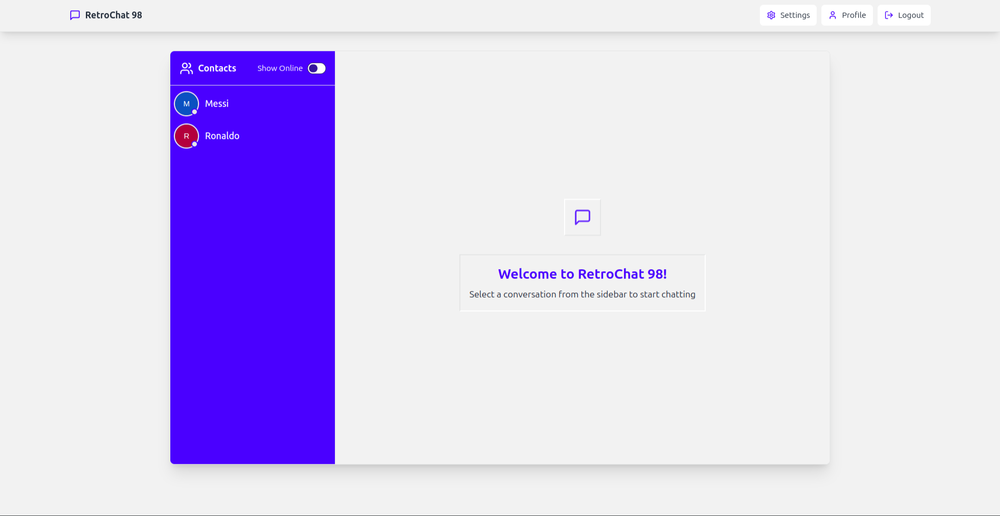
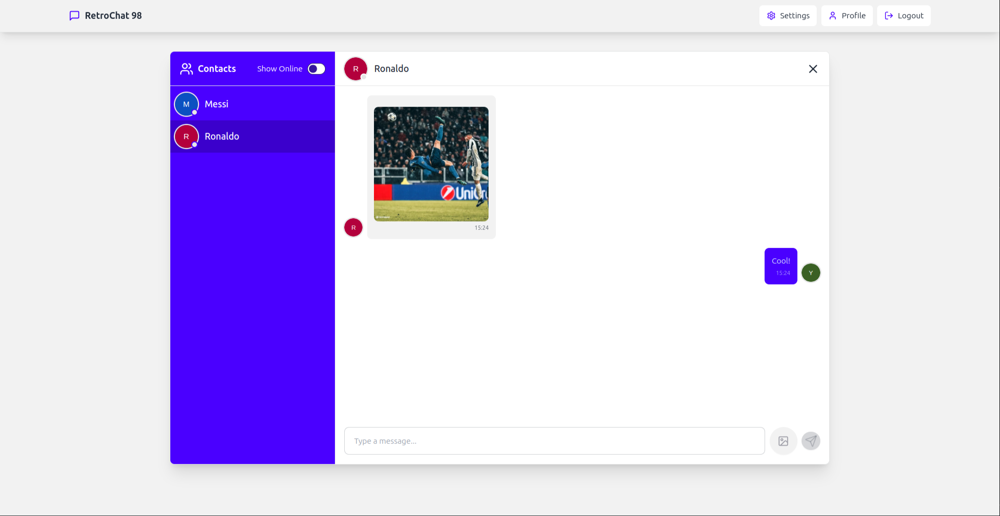
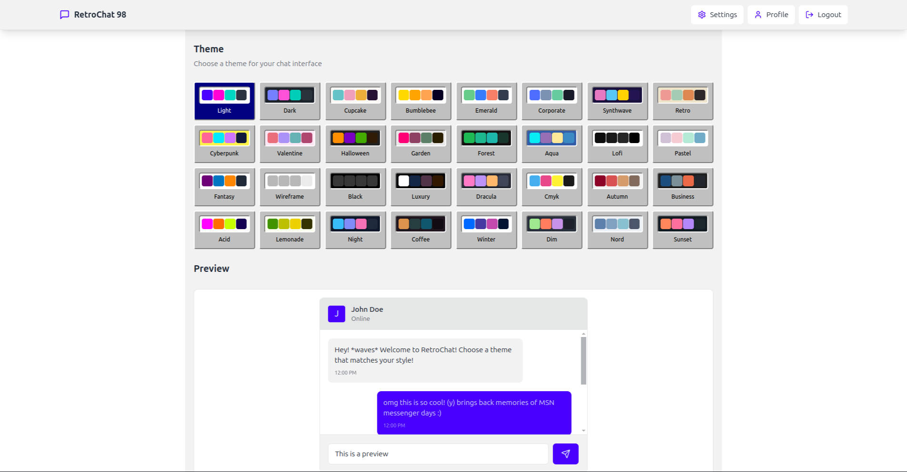

# 🪟 Windows 98 Style Real-Time Chat Application

A nostalgic yet modern real-time chat application that brings back the classic Windows 98 aesthetic while leveraging modern web technologies. Built with MERN stack and Socket.IO.








## ✨ Features

### 🔐 Authentication & Security
- **User Registration System**
  - Email validation
  - Secure password hashing with bcrypt
  - Duplicate email prevention
  - Profile picture upload during registration (optional)

- **Login System**
  - JWT-based authentication
  - Secure cookie storage
  - Persistent sessions
  - Auto-reconnect functionality

- **Security**
  - Protected routes
  - Token verification
  - Request validation
  - XSS protection
  - CORS configuration

### 💬 Real-Time Chat Features
- **Instant Messaging**
  - Real-time message delivery
  - Message status indicators
  - Emoji support
  - Link detection

- **User Status**
  - Real-time online/offline indicators
  - Last seen functionality
  - Typing indicators
  - Connection status updates

- **User List**
  - Real-time user list updates
  - Online users filter
  - Alphabetical sorting
  - Online status prioritization

### 👤 Profile Management
- **User Profiles**
  - Customizable display names
  - Profile picture management
  - Email updates
  - Join date display

- **Avatar System**
  - Cloudinary integration for image storage
  - Default avatars using initials
  - Real-time avatar updates
  - Image format optimization

### 🎨 User Interface
- **Windows 98 Design Elements**
  - Classic window decorations
  - Period-accurate buttons
  - Retro form controls
  - Nostalgic color scheme

- **Modern Enhancements**
  - Responsive layout
  - Mobile-friendly design
  - Smooth animations
  - Loading states

## 🛠 Technology Stack

### Frontend Technologies
- **React.js** - UI component library
- **Socket.IO Client** - Real-time communication
- **98.css** - Windows 98 style framework
- **React Router** - Client-side routing
- **Axios** - HTTP client
- **React Query** - Data fetching & caching

### Backend Technologies
- **Node.js** - Runtime environment
- **Express.js** - Web application framework
- **MongoDB** - Database
- **Socket.IO** - Real-time event handling
- **JWT** - Authentication
- **Cloudinary** - Image storage
- **Mongoose** - MongoDB object modeling

## 🚀 Getting Started

### Prerequisites
- Node.js (v14 or higher)
- MongoDB
- npm or yarn
- Cloudinary account

### Installation

## 🛠️ Installation

### Prerequisites
Before you begin, ensure you have the following installed:
- Node.js (v14 or higher)
- MongoDB
- npm or yarn
- A Cloudinary account

### Step 1: Clone the Repository
```bash
git clone <repository-url>
cd windows98-chat-app
```

### Step 2: Backend Setup
Navigate to the backend directory:
```bash
cd backend
npm install
```

Create a `.env` file in the backend directory with the following variables:
```bash
PORT=5000
MONGODB_URI=your_mongodb_connection_string
CLOUDINARY_CLOUD_NAME=your_cloudinary_cloud_name
CLOUDINARY_API_KEY=your_cloudinary_api_key
CLOUDINARY_API_SECRET=your_cloudinary_api_secret
```

Start the backend server:
```bash
npm start
```

### Step 3: Frontend Setup
Open a new terminal and navigate to the frontend directory:
```bash
cd frontend
npm install
npm run dev
```

### Step 4: Access the Application
Once both servers are running:
- Frontend: http://localhost:5173
- Backend: http://localhost:5000

### Configuration Notes
For MongoDB, create a database (local or Atlas) and use the connection string in your `.env` file. For Cloudinary, create an account at https://cloudinary.com, get your credentials from the dashboard, and add them to your `.env` file. The application will automatically generate a JWT secret on first run and save it in your `.env` file.

### Common Issues
Watch out for CORS issues (ensure frontend runs on port 5173), verify both servers are running for socket connections, and check Cloudinary credentials if image uploads fail. The frontend uses Vite for development, with TailwindCSS and DaisyUI for styling. Socket.IO handles real-time communications, JWT manages authentication, and Cloudinary handles image uploads.


### Demo
You can try this demo [Demo Project](https://mern-production-5syl.onrender.com/)
